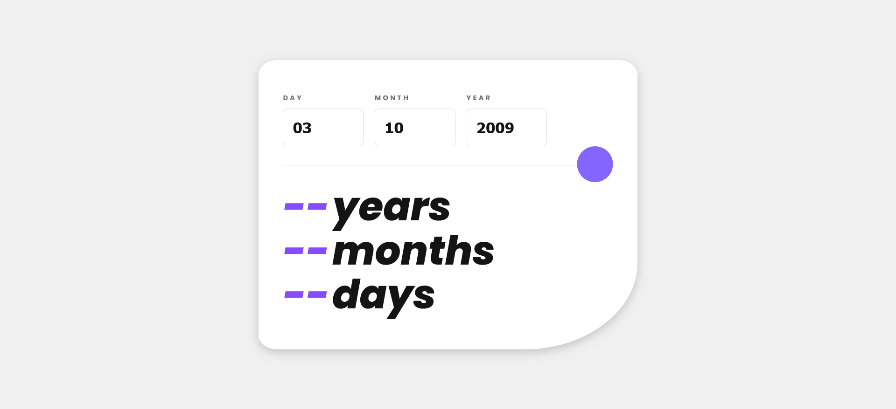
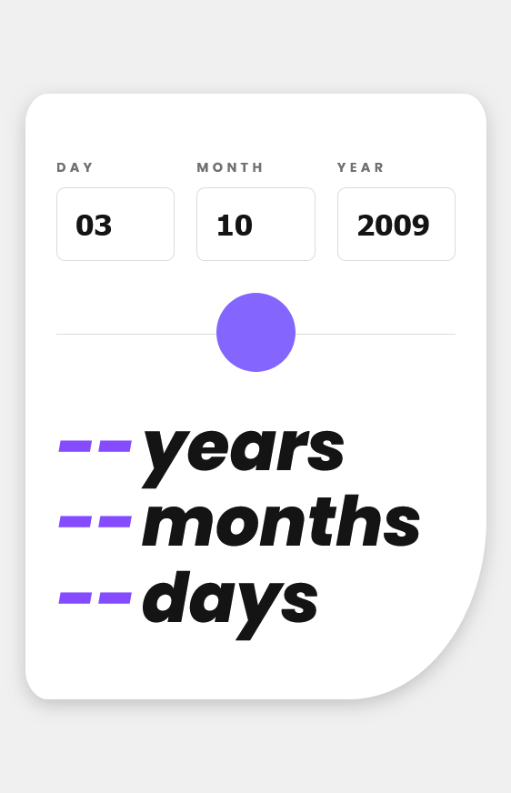

# Frontend Mentor - (Age calculator app) solution 🚀

## Welcome 👋

This is a solution to the [(Age calculator app) challenge on Frontend Mentor](https://www.frontendmentor.io/challenges/age-calculator-app-dF9DFFpj-Q/hub). Frontend Mentor challenges help you improve your coding skills by building realistic projects.

## Table of contents 📑

- [Overview](#overview-🌟)
  - [The Challenge](#the-challenge-🧪)
  - [Screenshots](#screenshots-📷)
  - [Links](#links-🔗)
- [My process](#my-process-🏗️)
  - [Built with](#built-with-🛠️)
  - [What I learned](#what-i-learned-🧠)
  - [Continued development](#continued-development-🚀)
  - [Useful resources](#useful-resources-📚)
- [Acknowledgments](#acknowledgments-🙏)
- [Contact](#contact-📧)
- [Author](#author-👤)

## Overview 🌟

### The Challenge 🧪

Users should be able to:

- ❌ View an age in years, months, and days after submitting a valid date through the form
- ❌ Receive validation errors if:
  - Any field is empty when the form is submitted
  - The day number is not between 1-31
  - The month number is not between 1-12
  - The year is in the future
  - The date is invalid e.g. 31/04/1991 (there are 30 days in April)
- ✅ View the optimal layout for the interface depending on their device's screen size
- ✅ See hover and focus states for all interactive elements on the page
- ❌ **Bonus**: See the age numbers animate to their final number when the form is submitted

I hope to add js functionality in the future, but for now, here's the plain html css page.

### Screenshots 📷

_My solution (Desktop):_

_Design_

_My solution (Mobile)_

_Design:_

### Links 🔗

- Solution repo on github [here](https://github.com/BeanyTheCoder/age-calculator-app-main)

## My process 🏗️

### Built with 🛠️

- HTML & CSS
- JavaScript(_In the future_)

### What I learned 🧠

Absolutely nothing! *yet...*

Indeed, when I finally implement some functionality using js, i will try to post here everything I learned from such experience, but for now, enjoy *blank page*

### Continued development 🚀

As mentioned previously, I plan to implement *actual* functionality in this site, but for now, it's completely static
## Contact 📧

- Frontend Mentor - [@BeanyTheCoder](https://www.frontendmentor.io/profile/BeanyTheCoder)
- Github - [BeanyTheCoder](https://github.com/BeanyTheCoder)

## Author 👤

My name is Alexander Afoko Jnr. and I am a passionate 13-year-old frontend developer from Ghana.
I hope to build up my portfolio and take my skills to the next level.
